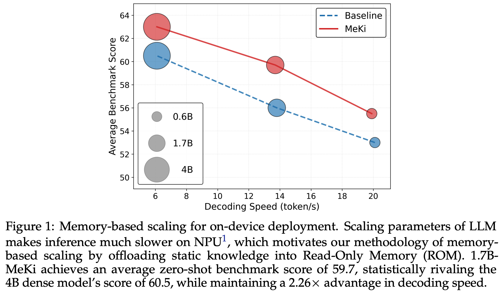

# MeKi 

Homepage for paper "MeKi: Memory-based Expert Knowledge Injection for Efficient LLM Scaling" 

Paper link : [](https://arxiv.org/pdf/2602.03359)

## 🌟 Introduction

**MeKi** (Memory-based Expert Knowledge Injection) is a novel paradigm for scaling LLMs on edge devices like smartphones. Unlike traditional methods that rely on increasing parameters or test-time compute (which are infeasible due to RAM/NPU constraints), **MeKi scales model capacity through memory storage instead of computation**.


---

## 📦 Data Preparation

### Installation

```bash
# Setup Environment: we use Megatron's official setup image
docker pull nvcr.io/nvidia/pytorch:25.06-py3
docker run xxx

# Clone repository
git clone https://github.com/ningding-o/MeKi.git
cd MeKi

# Install transformers
pip install transformers==4.51.3
```

### Dataset Preparation

```bash
# 1. Download pretraining corpus, we use "fineweb-edu-dedup"
huggingface-cli download HuggingFaceTB/smollm-corpus --include "fineweb-edu-dedup/*" --local-dir /pah/to/your/dataset/smollm-corpus --local-dir-use-symlinks False

# 2. Convert all the *.parquet files into .json format

# 3 Preprocess json files with Megatron's official script.
cd Megatron-LM/
python tools/preprocess_data.py \
    --input fineweb-edu-dedup.json \
    --output-prefix /pah/to/your/preprocessed_dataset/fineweb_edu_dedup \
    --tokenizer-model /pah/to/your/hf_model/Qwen/Qwen3-1.7B-Base \
    --tokenizer-type HuggingFaceTokenizer \
    --append-eod

# 4. You will get two files for Megatron training:
/pah/to/your/preprocessed_dataset/fineweb_edu_dedup_text_document.idx
/pah/to/your/preprocessed_dataset/fineweb_edu_dedup_text_document.bin
```

---

## 🚀 Training

### Quick Start
We provide a toy code to demonstrate the model logic and data flow of our method.
```
pip install torch easydict
python3 meki_modeling_demo.py
```


### Multi-GPU Training
We provide code to run large scale training with [Megatron](https://github.com/NVIDIA/Megatron-LM/tree/core_r0.12.0) on multi-GPU machines.
```bash
# We use "core_r0.12.0" branch
cd Megatron-LM/

# Launch training on 8 GPUs
base train_1_7B_meki_dim_256.sh

# The above script is tested on Nvidia H-series GPUs.
# Please adjust hyper-params according to your own configurations.
```


## 🤝 Citation

If you find MeKi useful to your research, please cite:

```bibtex
@article{ding2026meki,
  title={MeKi: Memory-based Expert Knowledge Injection for Efficient LLM Scaling},
  author={Ding, Ning and Liu, Fangcheng and Kim, Kyungrae and Hao, Linji and Lee, Kyeng-Hun and Ko, Hyeonmok and Tang, Yehui},
  journal={arXiv preprint arXiv:2602.03359},
  year={2026},
  url={https://arxiv.org/abs/2602.03359}
}

